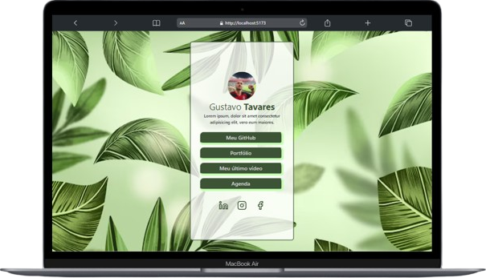
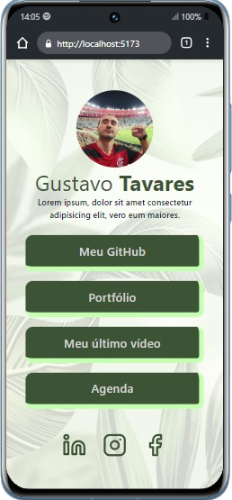

## Linktree Clone Layout

Este é um projeto clone do layout do Linktree iniciado com [Vite](https://vitejs.dev/) e desenvolvido com Typescript. 

Os frameworks utilizados para o desenvolvimento foram:

✔ Tailwind CSS &nbsp;
✔ Shadcn

&nbsp;
## 👨🏻‍💻 Começando...

Primeiro, execute os seguintes comandos no cmd da sua IDE:

```bash
npm install
```

```bash
npm run dev
```

&nbsp;

👍🏻 Execute o projeto no navegador com `localhost://5173`

&nbsp;
## 💻📱 Layouts do projeto

O projeto contém responsividade em suas páginas.

| Desktop | Mobile |
|--|--|
| | |
